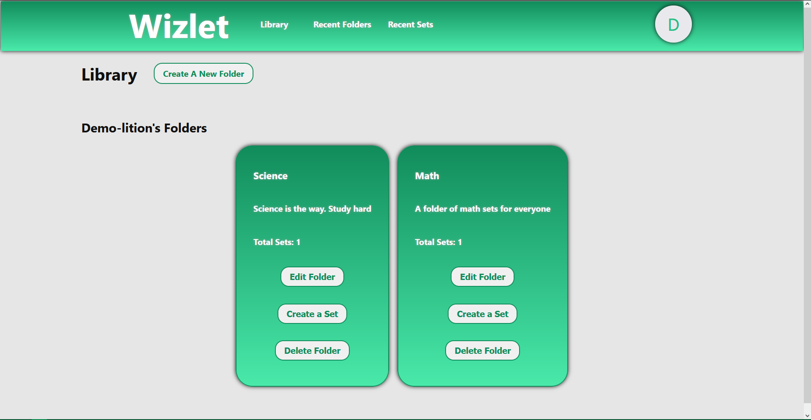
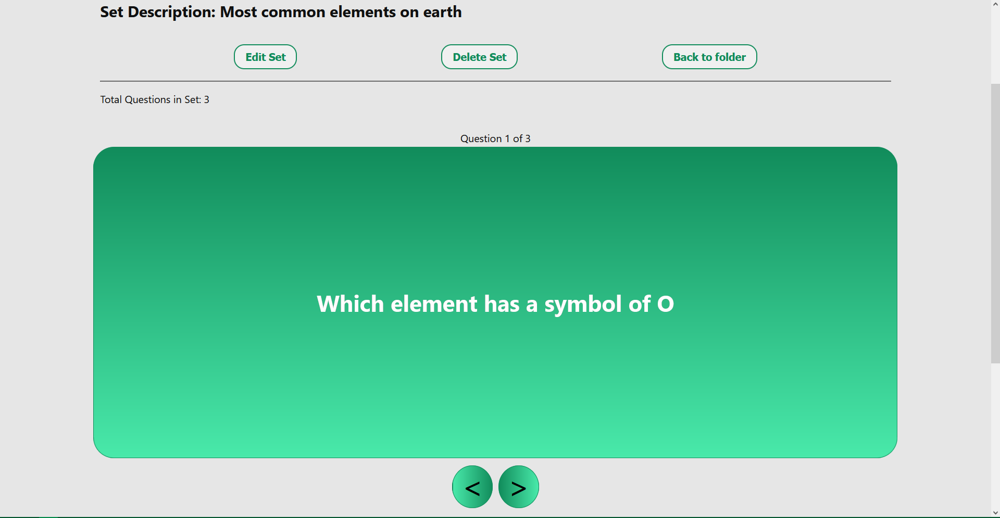
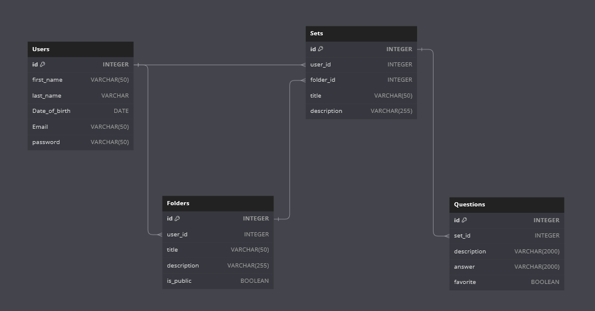

# Wizlet

## Table of Contents
- [Wizlet](#Wizlet)
  - [Table of Contents](#table-of-contents)
  - [About](#about)
  - [Technologies](#technologies)
  - [Frontend](#frontend)
  - [Features](#features)
  - [Database Schema](#database-schema-design)
  - [Contact](#contact)

## About
Wizlet is an application for booking some very unique chairs located in various spots in the United States, that centers on bringing people back to relaxing away from the hustle and bustle of busy city lives. My site is live on https://wizlet.onrender.com/

## Technologies
React/Redux CSS
Python 3.9,
Flask,
SQLAlchemy,
React JS 17,
Redux,
Validator JS

<!--!!END -->
<!--!!ADD -->
<!-- # `<name of application here>` -->
<!--!!END_ADD -->

## Frontend

### Library

### Card Carousel

## Features
- Logged in users can perform the following actions:
  - Create, view, update and delete folders
  - Create, view, update and delete sets
  - Create, view, update and delete questions
  
## Database Schema Design

<!--!!START SILENT -->

<!--!!END -->
<!--!!ADD -->
<!-- `<insert database schema design here>` -->
<!--!!END_ADD -->
## Future Features
### Saved Favorites
Logged in Users can
* Save their favorite sets and questions from each set.

### User Avatar
Logged in Users can
* Upload a single profile image for each User's Avatar.

## API Documentation
- [API Documentation](./oldREADME.md)

## Contact

* Christopher Simpson:
    * LinkedIn: https://www.linkedin.com/in/christopher-simpson-sc/
    * GitHub: https://github.com/simpsonc86